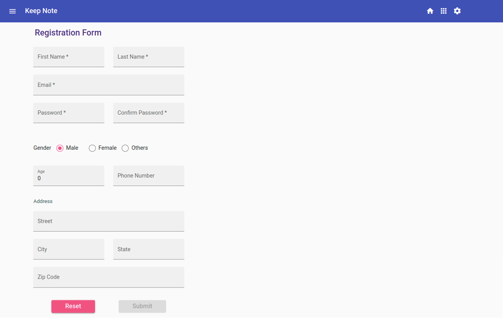
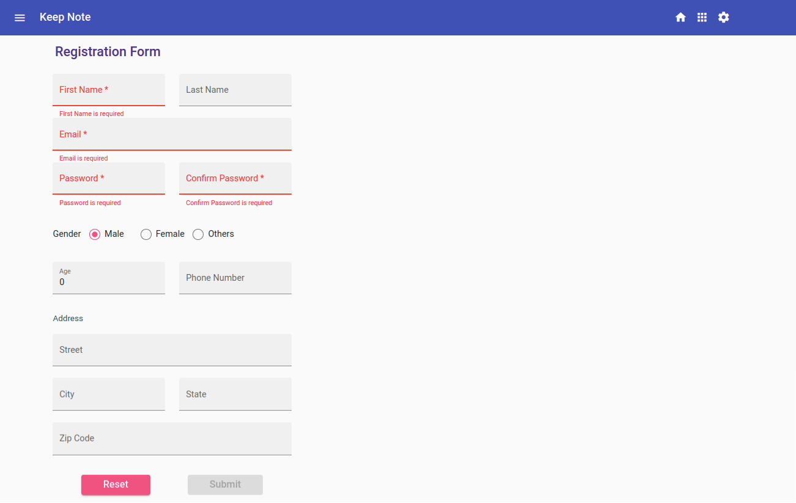
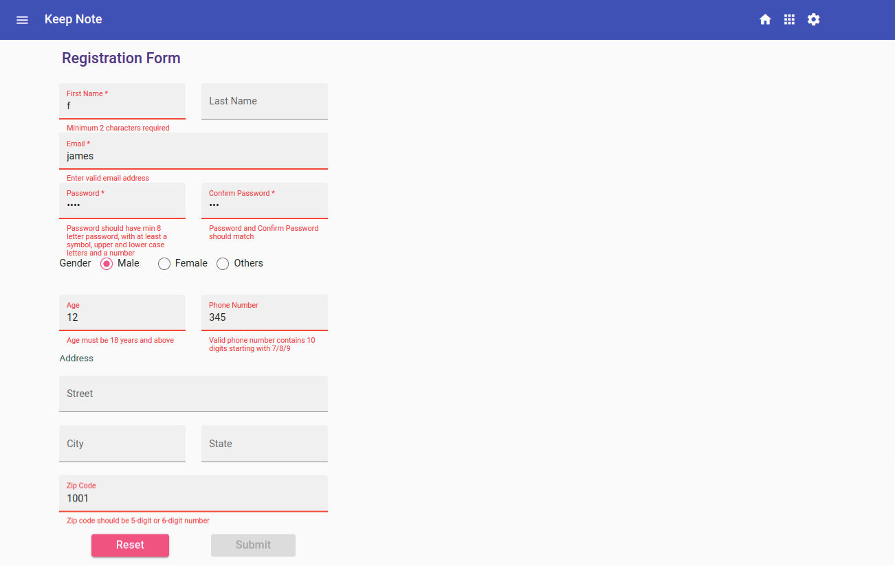
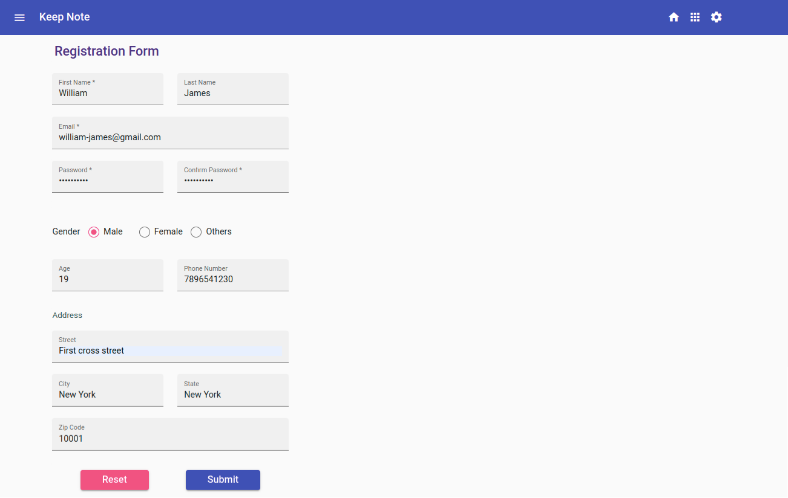
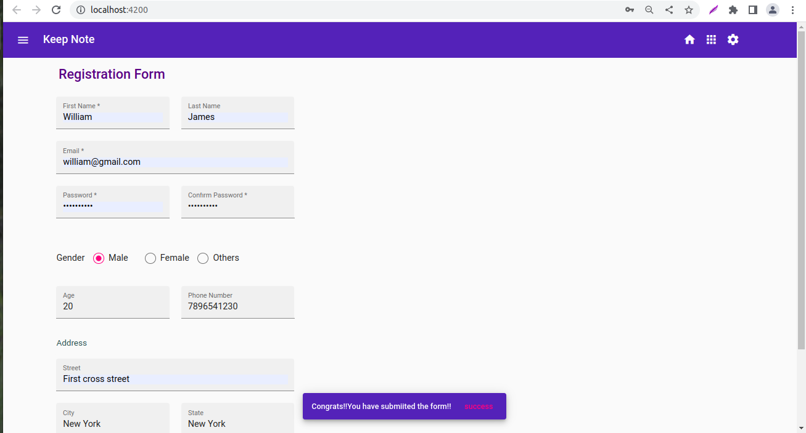

## Challenge - Develop a User Registration Form for the Keep Note application

### Context

As you are aware, Keep-Note is a web application that allows users to maintain notes. It is developed as a single-page application using multiple components. ​

Note: The stages through which the development process will be carried out are shown below:​

- Stage 1: Create basic Keep-Note application to add and view notes.​
- Stage 2: Implement unit testing for the Keep-Note application.​
- Stage 3: Create Keep-Note application with multiple interacting components to add, view and search notes.​
- Stage 4: Implement persistence in the Keep-Note application.​
- Stage 5: Style the Keep-Note application using Material design.​
- Stage 6: Create a simple form with validation in the Keep-Note application.​
- **Stage 7: Create a complex form with validation in the Keep-Note application.**
- Stage 8: Enable navigation in the Keep-Note application.​
- Stage 9: Secure routes in the Keep-Note application

In this sprint, we are at Stage 7.​

In the previous stage, a template-driven form was created to add a new note.​

In this stage, a reactive form with validations using Angular Material components should be created to register a new user.

## Problem Statement

Develop a user registration form to add a new user using Angular reactive forms. The data model for the user should include the following properties: ​firstName, lastName, password, confirmPassword, gender, age, email, phone, and address. (The address property should contain details: street, city, state, and zipCode).

### Tasks

Following are the task to complete the solution.​

- Task 1: Include Required Modules ​in the App module
- Task 2: Create the `RegisterFormComponent`
- Task 3: Define the form group​
- Task 4: Add validators to the form controls
- Task 5: Create the HTML form in the template 
- Task 6: Handle form validation
- Task 7: Display a notification message upon successful form submission​

**Notes:**
1. Details related to a few tasks are given below.​
2. The RegisterFormComponent will be used in the next sprint: `Implement Navigation Using Angular Routing` to integrate with the existing Keep-Note application.​

### Task 2: Create `RegisterFormComponent`
- Create a new component with the name RegisterForm.​
- This component is used to develop the registration form to register a new user.​
- The Keep-Note application should now get launched with the RegisterFormComponent.

**Note: The `RegisterFormComponent` name mentioned above is used in testing, so you must use the same names while coding.**  ​

### Task 3: Define the form group

- Create a form group with the name `registerForm` that has the following:
    - Form controls:`firstName`, `lastName`, `password`, `confirmPassword`, `gender`, `age`, `email` and `phone`.
    - Sub form group called `address` that has the following form controls:
        - `street`, `city`, `state` and `zipCode`. 

**Note: The form group names and form control names mentioned above are used in testing and so you must use the same name while coding.**

### Task 4: Add validators to the form controls
    
- Following are the form controls with their validation criteria.​

|Form Control | Validation|
|------------|-------------|
|First Name|Should not be blank and have minimum length of 2 characters​|
|Last Name|No validation​|
|Email|Should not be left blank and should accept a valid email id|
|Password|Should not be left blank and should have a minimum 8 characters with at least one symbol, one upper-case letter, one lower-case letter, and one number​|
|Confirm Password|Should not be blank and should be as same as password value|
|Gender| No validation (Select from the given set of values: Male, Female and Others)|
|Age| Should be initialized to zero and shoule be greater than or equal to 18 years|
|Phone| Should accept only a 10-digit number starting with 7, 8, or 9|
|Street|No validation​|
|City|No validation|
|State|No validation|
|Zip code|Should be 5-digit or 6- digit number|

- Custom validator functions should be created inside `register.component.ts` file for the following criteria.​
    - Age value should be greater than or equal to 18.​(Single field validator – should be added for age form control)​
        - Should return an object `{ invalidAge: true}` when age value entered is less than 18​
    - Password and Confirm password values should be equal.​(Multi-field validator – should be added at the form level)​
        - Should return an object `{passwordMismatch: true}` when password and confirm password values entered are not equal.​
    - Proper error message should be displayed by checking these values using `<mat-error>` and `*ngIf` directive inside the template code.​

**Notes:** 
1. Object key names – `invalidAge` and `passwordMismatch` mentioned above are used in testing and so you must use the same names inside the code.
2. Avoid using HTML5 attributes for validating the rest of the form controls.​

The reactive form created should resemble the following images.

**Registration Form**

**Registration Form With Validation Errors**

**Registration Form With Valid Values**

**Successful Form Submission**

#### Points To Remember
- In phase 5 development, the solution created for the Keep Note application in the previous sprint `Develop Interactive Template-Driven Forms Inside SPA` must be used.​
- Copy the files from the `app` folder of the keep-note solution developed for the challenge of the previous sprint - `Develop Interactive Template Driven Forms Inside SPA`.​
    -  Paste these files in the `app` folder of the boilerplate code.
- A new Registration component should be created for developing the registration form. The landing page for the Keep Note application should be the newly developed Registration component.
- ​This component will be used in the next following Angular Routing sprints to integrate with the existing Keep Note application.​
- Angular Reactive form should be created to add a new user. The form input elements must be created using Angular material components​
- All the required modules to work with Angular forms and material components should be imported in the application root module.​
- Use formGroup and formControl directives to bind the form model with template.​
- Use built-in and custom validator functions to validate form input values. ​
- Use `<mat-error>` to display validation error messages.​
- Custom styles should be added while designing the form.​
- The newly added user should be saved in `notes.json` file in the `keep-note-data` folder  using User service.

### Submission Instructions

#### Test the solution locally
- Test the solution first locally and then on `CodeReview` platform. Steps to test the code locally are:​
    - From the command line terminal, set the path to the folder containing cloned boilerplate code.​
    - un the command ng test or npm run test to test the solution locally and ensure all the test cases pass.​
    - Refactor the solution code if the test cases are failing and do a re-run.​​
    - Finally, push the solution to git for automated testing on `CodeReview` platform.​

#### Test the Solution on `CodeReview` platform
Steps to test the code on hobbes are:​
- Open the submission page at `https://codereview.stackroute.niit.com/#/submission`.​
- Submit the solution.​
- For the failed test cases, refactor the code locally and submit it for re-evaluation.​